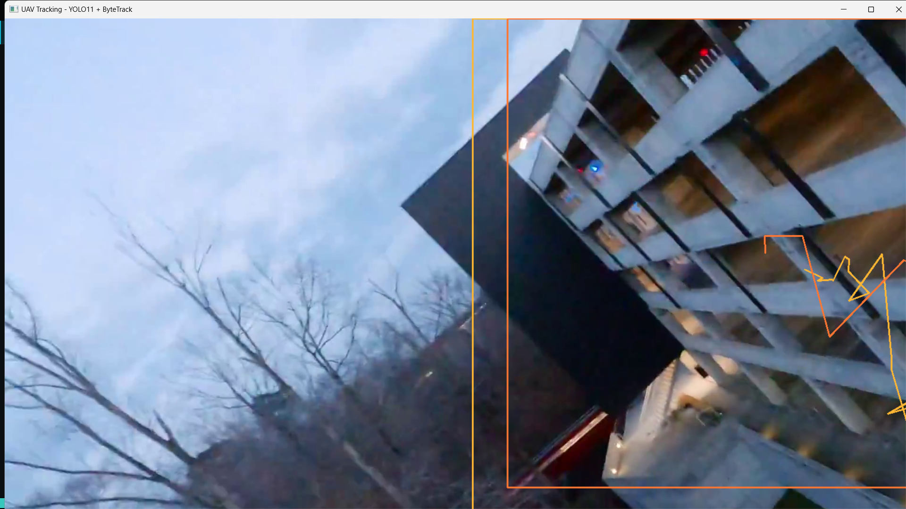
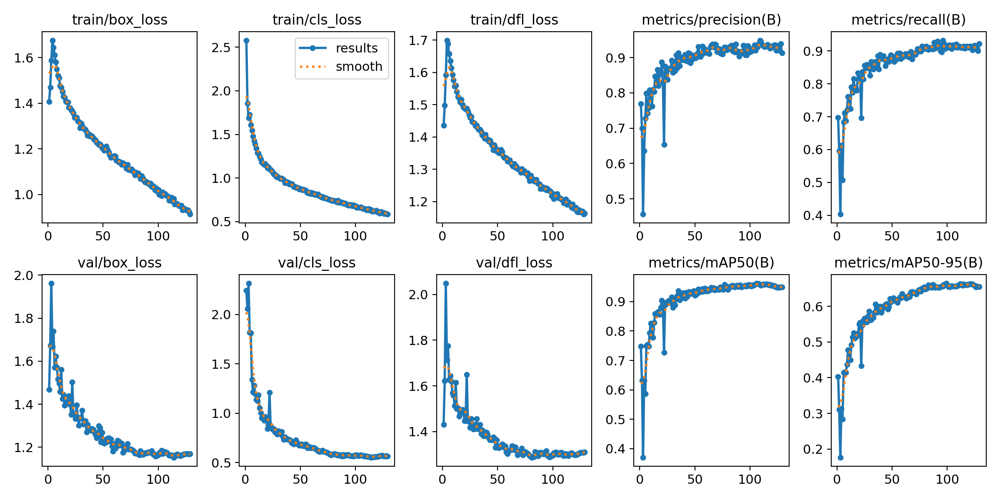

# 🚁 Real-Time UAV Detection & Tracking System
### Powered by YOLO11 & ByteTrack

> **Project Duration:** Nov 2025 – Dec 2025

---

## 📸 Project Demo
> 

---

## 📖 Overview
I built an end-to-end **Real-Time UAV (Drone) Detection and Tracking System**. The goal was to create a lightweight, high-performance model capable of detecting small, fast-moving aerial objects in complex environments, optimized for Edge AI deployment.

This project reinforces the critical role of **Data Quality** and **Pipeline Optimization** in production-grade AI.

---

## 💡 The Challenge: It’s Not Just About the Model
Initially, I faced a classic computer vision problem: **Overfitting and False Positives**.

My early model (trained on ~200 images) achieved high mAP metrics during training but failed in real-world scenarios. It frequently confused **buildings and excavators** for drones due to high-contrast features.

> 
 

---

## 🛠️ The Engineering Journey (Data-Centric Approach)
Instead of blindly changing model architectures, I adopted a **Data-Centric AI approach** to solve the root cause:

### 1. Dataset Expansion
Scaled the dataset from **200 to 6,600+ images** using video frame extraction and data augmentation techniques to capture diverse angles and lighting conditions.

### 2. Hard Negative Mining (The Game-Changer)
I deliberately fed the model "empty" images of buildings, trees, and construction equipment (without drones) to explicitly teach the model what is **NOT** a drone. This strategy eliminated 99% of false positives.

### 3. Tracker Integration
Integrated **ByteTrack** (and experimented with DeepSORT) to handle object occlusion and low-confidence detections, ensuring stable ID tracking even during rapid maneuvers.

---

## ⚙️ Tech Stack

| Component | Technology | Description |
| :--- | :--- | :--- |
| **Model** | **Ultralytics YOLO11n (Nano)** | Chosen for optimal speed/accuracy trade-off on Edge devices. |
| **Tracking** | **ByteTrack & DeepSORT** | Algorithms for robust object association and trajectory prediction. |
| **Optimization** | **AMP (Mixed Precision)** | Accelerated training on NVIDIA GPU. |
| **Pipeline** | **Python, OpenCV, PyTorch** | Core development stack. |
| **Hardware** | **NVIDIA Jetson** | Target deployment device (Edge AI). |

---

## 📊 Results & Performance

> 

* **Accuracy:** Achieved **>0.8 mAP50** within the first 10 epochs of retraining.
* **Robustness:** Successfully eliminated **99% of false positives** on complex backgrounds (buildings/construction sites).
* **Deployment:** Model is optimized and ready for deployment on edge devices like NVIDIA Jetson.
